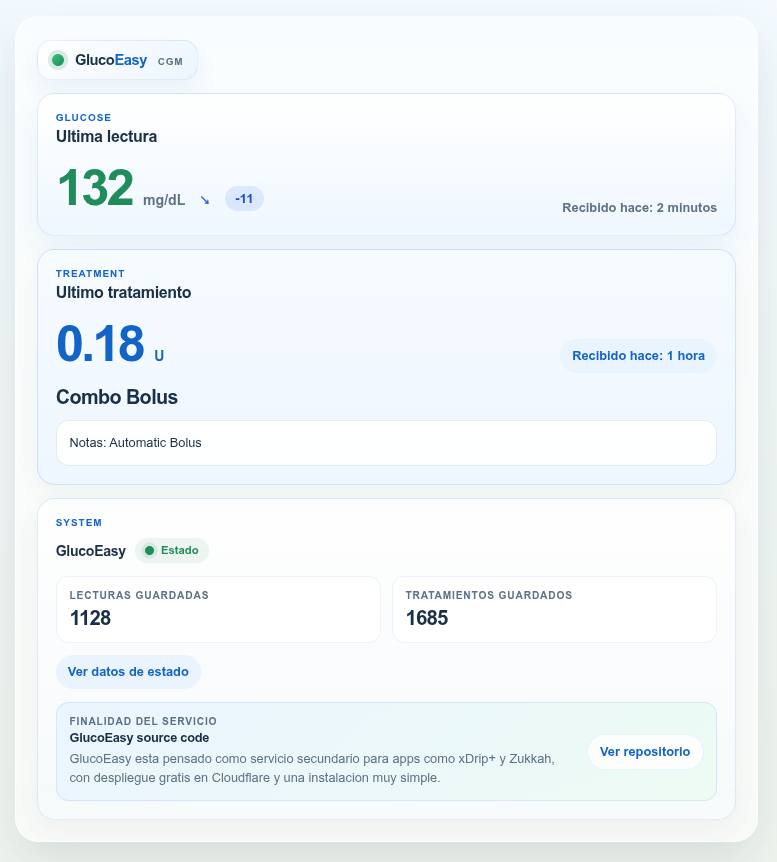
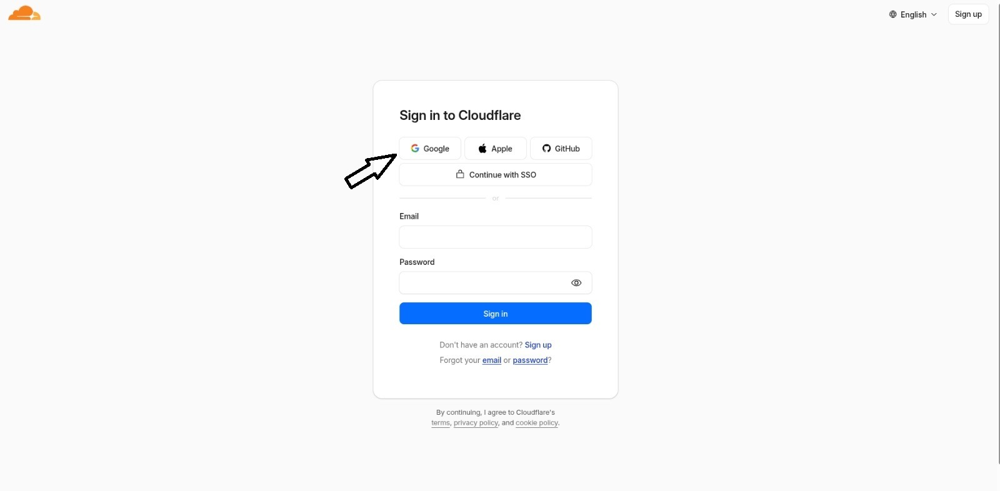
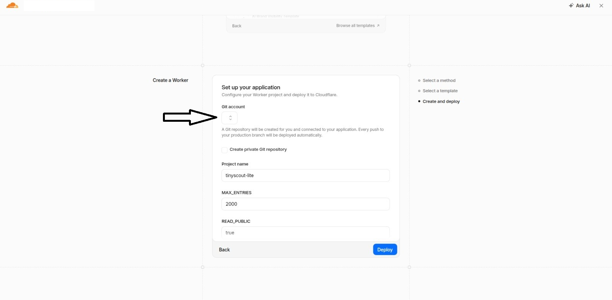
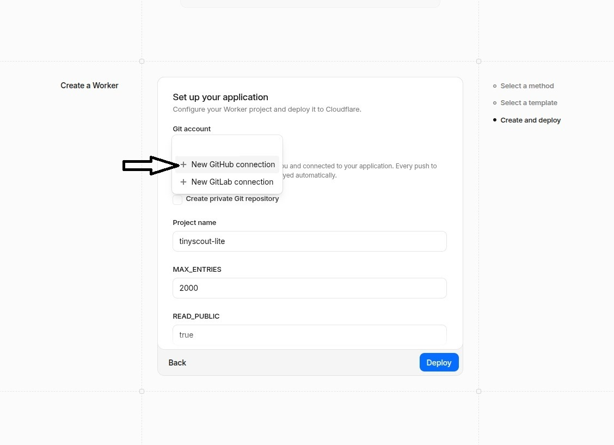
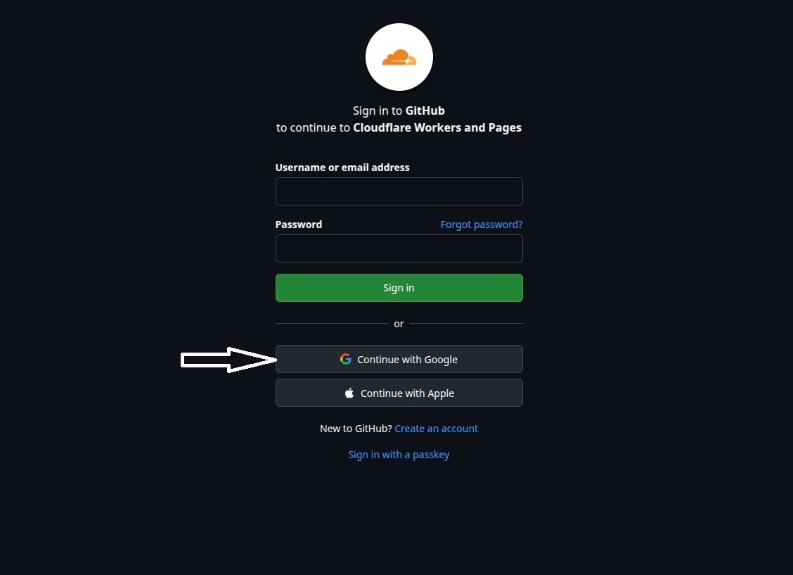
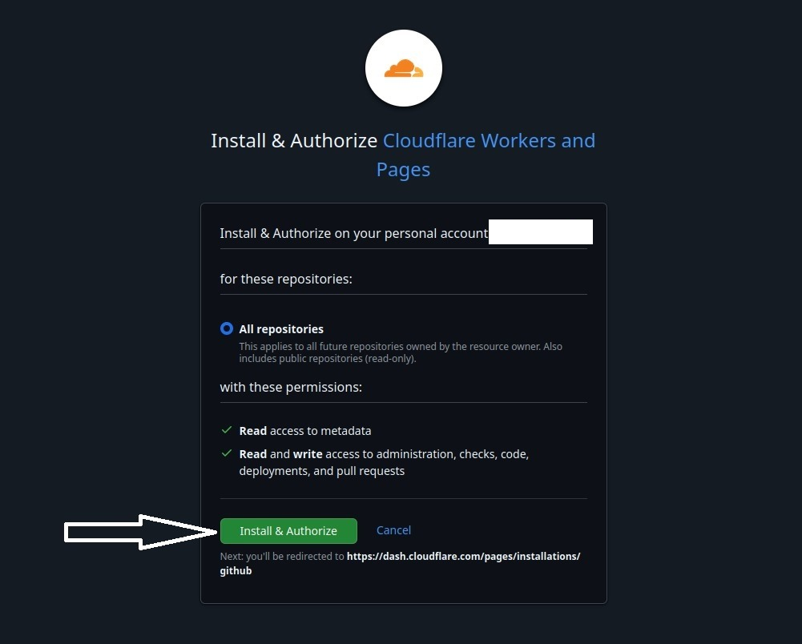
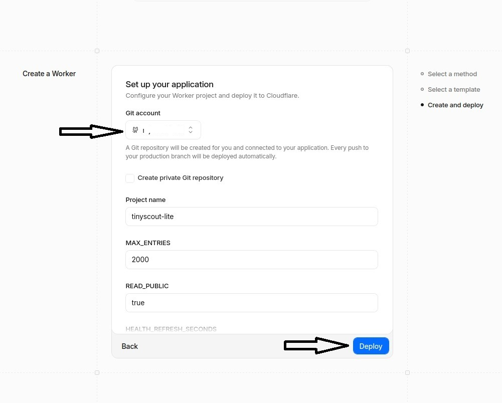

# GlucoEasy

Este proyecto nace de algo muy personal.

Mi hijo debutó con diabetes tipo 1 con solo 2 años. Desde entonces, la tecnología forma parte de nuestro día a día: usa Dexcom G7 junto con Tandem, y aunque el servicio oficial suele funcionar bien, la sensación de quedarte sin acceso justo en el momento en que más lo necesitas pesa mucho cuando detrás de la pantalla está la salud de tu hijo.

GlucoEasy nace precisamente de esa necesidad de tener un respaldo. De saber que, si el servicio oficial falla, sigo teniendo una segunda vía disponible. No sustituye nada: simplemente me da algo que para mí vale muchísimo, tranquilidad.

Además, me permite conectar con aplicaciones más completas dentro del ecosistema de la diabetes, como `Zukkah`, `xDrip+` y también apps de smartwatch, siempre que sean compatibles con Nightscout.

GlucoEasy es un servicio secundario de monitorización de glucosa que puedes desplegar gratis en Cloudflare.

Nace para un caso muy concreto: cuando tu servicio principal o el proveedor oficial falla, tener una segunda opción funcionando te da tranquilidad sin obligarte a mantener una instalación compleja.

GlucoEasy se centra en lo esencial:

- actuar como respaldo cuando tu servicio principal no responde
- seguir funcionando con apps que ya usan Nightscout
- permitirte usar apps como `xDrip+`, `Zukkah` y otras parecidas
- desplegarse de forma muy fácil y gratis en la nube

Versión en inglés: ver [README.md](README.md).  
Guía técnica: ver [README.technical.es.md](README.technical.es.md).



## Advertencia Importante

- No es un dispositivo médico.
- No debe usarse para dosificación ni decisiones de tratamiento.
- Úsalo solo como respaldo, recuperación o forma sencilla de mantener tus conexiones funcionando.

## Para Quién Es

Este proyecto es para ti si:

- quieres una segunda opción cuando falle el servicio principal
- ya usas `xDrip+`, `Zukkah` o cualquier app que funcione con Nightscout
- buscas algo muy fácil de instalar y mantener
- quieres un despliegue gratis en la nube
- te importan sobre todo las lecturas de glucosa, los bolos y la compatibilidad amplia

## Qué Hace

- Recibe lecturas de glucosa desde `xDrip+`
- Guarda lecturas recientes y tratamientos
- Se entiende con apps que ya estaban pensadas para Nightscout
- Funciona como servicio secundario para apps y herramientas compatibles
- Muestra una página simple de estado en el navegador

## Qué No Hace

- No es Nightscout completo
- No es tu sistema médico principal
- No incluye gráficas, informes ni análisis avanzados

Si necesitas la experiencia completa de Nightscout, Nightscout completo sigue siendo la mejor opción.

## Crear Tu Copia Gratis

La forma más fácil de empezar es pulsar aquí para instalar GlucoEasy gratis.

No hace falta entender qué es Cloudflare ni saber "desplegar" nada: solo sigue las pantallas y al final tendrás tu enlace listo para usar.

<a href="https://deploy.workers.cloudflare.com/?url=https%3A%2F%2Fgithub.com%2FHankScorpi0%2FGlucoEasy" target="_blank" rel="noopener noreferrer">Instalar GlucoEasy gratis</a>

## Instalación En 3 Pasos

1. Haz clic en `Instalar GlucoEasy gratis` o en el botón de abajo.
2. Sigue las pantallas hasta que termine la instalación.
3. Abre el enlace que se crea para ti, por ejemplo `https://tu-worker.workers.dev/health`.

En la primera visita, GlucoEasy crea automáticamente un código secreto de 6 caracteres y lo muestra una sola vez. Guárdalo en ese momento, porque lo necesitarás en `xDrip+` o en cualquier otra app compatible.

## Guía Detallada De Despliegue

Si es tu primera vez usando Cloudflare Workers, estas son las pantallas y los pasos exactos que deberías seguir:

1. Abre el enlace `Instalar GlucoEasy gratis`.
2. En la pantalla de inicio de sesión de Cloudflare, entra con `Google` si esa es la cuenta que quieres usar.



3. En la pantalla `Set up your application`, abre el selector `Git account`.
4. Elige `New GitHub connection`.





5. Se abrirá GitHub. Inicia sesión allí y, si tu acceso a GitHub usa Google, pulsa `Continue with Google`.
6. Si todavía no tienes cuenta de GitHub, completa el formulario de registro y crea una.
7. Cuando GitHub pida autorizar `Cloudflare Workers and Pages`, acepta con `Install & Authorize`.






8. Volverás a Cloudflare. Comprueba que tu cuenta de GitHub ya aparece en `Git account`.
9. Deja los valores del proyecto tal como vienen, salvo que necesites cambiarlos, y después pulsa `Deploy`.



10. Espera a que termine el registro de despliegue. Al finalizar, Cloudflare mostrará la URL de tu worker, por ejemplo `https://tu-worker.workers.dev`.
11. Abre `https://tu-worker.workers.dev/health`.
12. Guarda el secreto de 6 caracteres que aparece en esa página y también la URL completa para xDrip+, por ejemplo `https://API_SECRET@tu-worker.workers.dev/api/v1/`.


Si Cloudflare te pide permiso para crear o conectar un repositorio durante la instalación, acéptalo. Esa conexión es la que permite completar correctamente el flujo de instalación con un clic.

## Configurar xDrip+

En `xDrip+`, usa la opción `Nightscout Sync REST API` e introduce:

```text
https://API_SECRET@tu-worker.workers.dev/api/v1/
```

Sustituye:

- `API_SECRET` por tu código secreto de 6 caracteres
- `tu-worker.workers.dev` por el enlace que se creó para ti

Importante:

- mantén `/api/v1/` exactamente como aparece
- no borres la `/` final

## Apps Compatibles

Como GlucoEasy funciona con el formato que usan muchas apps de Nightscout, puedes conectarlo a:

- `xDrip+`
- `Zukkah`
- otras apps o integraciones que ya funcionen con Nightscout

Ese es uno de sus puntos fuertes: no tienes que cambiar toda tu forma de uso, solo añadir un respaldo.

## Cómo Comprobar Que Funciona

Abre esta página en tu navegador:

```text
https://tu-worker.workers.dev/health
```

Página en español:

```text
https://tu-worker.workers.dev/es/health
```

Ejemplo de la pantalla de estado en español:


Deberías ver:

- la última lectura de glucosa
- el último tratamiento, si existe
- cuántas lecturas hay guardadas
- cuántos tratamientos hay guardados

También puedes revisar:

```text
https://tu-worker.workers.dev/api/v1/status.json
```

## Si Algo No Funciona

### No Aparecen Datos

- Comprueba que `xDrip+` use la URL completa con `/api/v1/`
- Comprueba que el código secreto sea correcto
- Abre `/health` y revisa si aparecen lecturas recientes

### Error 401

- Lo más probable es que el secreto sea incorrecto
- Usa el mismo secreto de 6 caracteres que viste en la primera configuración

### Has Olvidado El Secreto

- La solución más sencilla suele ser desplegar de nuevo y guardar bien el nuevo secreto
- Los usuarios avanzados pueden cambiarlo manualmente; ver [README.technical.es.md](README.technical.es.md)

### La Página Abre Pero Los Datos Son Antiguos

- Revisa la hora y la zona horaria del teléfono
- GlucoEasy solo conserva las lecturas más recientes

## Licencia

Este proyecto está licenciado bajo MIT. Consulta [LICENSE](LICENSE).
