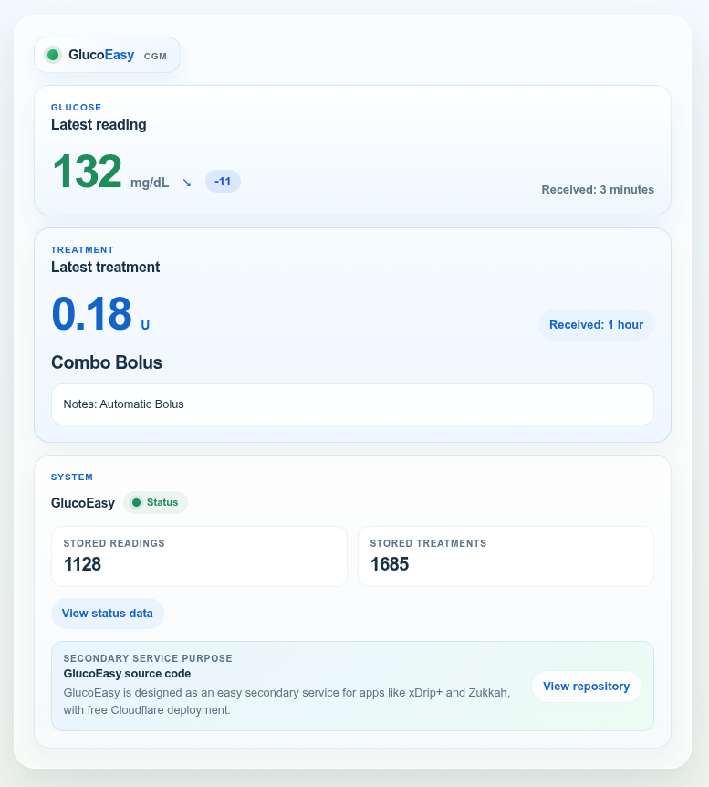

# GlucoEasy

This project was born from something deeply personal.

My son was diagnosed with type 1 diabetes when he was only 2 years old. Since then, technology has become part of our everyday life: he uses Dexcom G7 together with Tandem, and although the official provider service usually works well, losing access right when you need it most feels very different when your child's health is on the other side of the screen.

GlucoEasy was born from that need for a backup. From wanting to know that if the official service fails, I still have a second path available. It does not replace the official system; it simply gives me something that matters enormously to me: peace of mind.

It also lets us connect with richer diabetes apps such as `Zukkah`, `xDrip+`, and even smartwatch apps, as long as they are compatible with Nightscout.

GlucoEasy is a secondary glucose monitoring service you can deploy for free on Cloudflare.

It was built for a very specific case: when your main service or official provider fails, having a simple second option gives you peace of mind without forcing you into a heavy deployment.

GlucoEasy keeps the essentials:

- act as a fallback when your primary service is down
- keep working with apps that already use Nightscout
- let you use apps like `xDrip+`, `Zukkah`, and other similar apps
- stay very easy to install and free to deploy in the cloud

Spanish version: see [README.es.md](README.es.md).  
Technical guide: see [README.technical.md](README.technical.md).



## Important Warning

- This is not a medical device.
- Do not use it for dosing or treatment decisions.
- Use it only as a backup, recovery, or simple way to keep your connections working.

## Who This Is For

This project is for you if:

- you want a secondary option when the primary service fails
- you already use `xDrip+`, `Zukkah`, or any app that works with Nightscout
- you want something very easy to install and maintain
- you want a free cloud deployment
- you mainly care about glucose readings, boluses, and broad ecosystem compatibility

## What It Does

- Receives glucose readings from `xDrip+`
- Stores recent readings and treatments
- Works with apps that were already built for Nightscout
- Works as a secondary service for compatible apps and tools
- Shows a simple health page in the browser

## What It Does Not Do

- It is not full Nightscout
- It is not your primary medical system
- It does not include charts, reports, or advanced analysis

If you need the complete Nightscout experience, full Nightscout is still the better fit.

## Create Your Free Copy

The easiest way to start is to click here and install GlucoEasy for free.

You do not need to understand what Cloudflare is or know what "deploy" means: just follow the screens and you will end up with a ready-to-use link.

<a href="https://deploy.workers.cloudflare.com/?url=https%3A%2F%2Fgithub.com%2FHankScorpi0%2FGlucoEasy" target="_blank" rel="noopener noreferrer">Install GlucoEasy for free</a>

## Install In 3 Steps

1. Click `Install GlucoEasy for free` or the button below.
2. Follow the screens until the setup finishes.
3. Open the link created for you, for example `https://your-worker.workers.dev/health`.

On the first visit, GlucoEasy creates a 6-character secret code automatically and shows it once. Save it immediately, because you will need it in `xDrip+` or any other compatible app.

## Detailed Deployment Walkthrough

If this is your first time using Cloudflare Workers, these are the exact screens you should expect:

1. Open the `Install GlucoEasy for free` link.
2. On the Cloudflare sign-in page, continue with `Google` if that is the account you want to use.


3. In the `Set up your application` screen, open the `Git account` selector.
4. Choose `New GitHub connection`.


5. GitHub will open. Sign in there, and if you use Google for GitHub, continue with `Continue with Google`.
6. If you do not already have a GitHub account, complete the GitHub sign-up form and create it.
7. When GitHub asks to authorize `Cloudflare Workers and Pages`, approve it with `Install & Authorize`.


8. You will return to Cloudflare. Confirm that your GitHub account now appears in `Git account`.
9. Leave the default project values unless you specifically need to change them, then click `Deploy`.


10. Wait for the deployment log to finish. When it completes, Cloudflare will show your worker URL, for example `https://your-worker.workers.dev`.
11. Open `https://your-worker.workers.dev/health`.
12. Save the 6-character secret shown on that page and also save the full xDrip+ URL shown there, for example `https://API_SECRET@your-worker.workers.dev/api/v1/`.


If Cloudflare asks for permission to create or connect a repository during setup, accept it. That connection is what allows the one-click installation flow to finish correctly.

## Configure xDrip+

In `xDrip+`, use the `Nightscout Sync REST API` option and enter:

```text
https://API_SECRET@your-worker.workers.dev/api/v1/
```

Replace:

- `API_SECRET` with your 6-character secret code
- `your-worker.workers.dev` with the link created for you

Important:

- keep `/api/v1/` exactly as shown
- do not remove the final `/`

## Compatible Apps

Because GlucoEasy works with the format many Nightscout apps already use, you can connect it to:

- `xDrip+`
- `Zukkah`
- other apps or integrations that already work with Nightscout

That is one of its main strengths: you do not need to rebuild your workflow, only add a backup.

## Check That It Works

Open this page in your browser:

```text
https://your-worker.workers.dev/health
```

Spanish page:

```text
https://your-worker.workers.dev/es/health
```

English `health` page example:


You should see:

- the latest glucose reading
- the latest treatment, if any
- how many readings are stored
- how many treatments are stored

You can also check:

```text
https://your-worker.workers.dev/api/v1/status.json
```

## If Something Does Not Work

### No Data Appears

- Check that `xDrip+` is using the full URL with `/api/v1/`
- Check that the secret code is correct
- Open `/health` and see whether recent readings appear

### Error 401

- The secret is probably wrong
- Use the same 6-character secret shown during the first setup

### You Forgot The Secret

- The easiest fix is usually to deploy again and save the new secret carefully
- Advanced users can replace it manually; see [README.technical.md](README.technical.md)

### The Page Opens But Data Is Old

- Check the phone time and timezone
- GlucoEasy only keeps the most recent entries

## License

This project is licensed under the MIT License. See [LICENSE](LICENSE).
